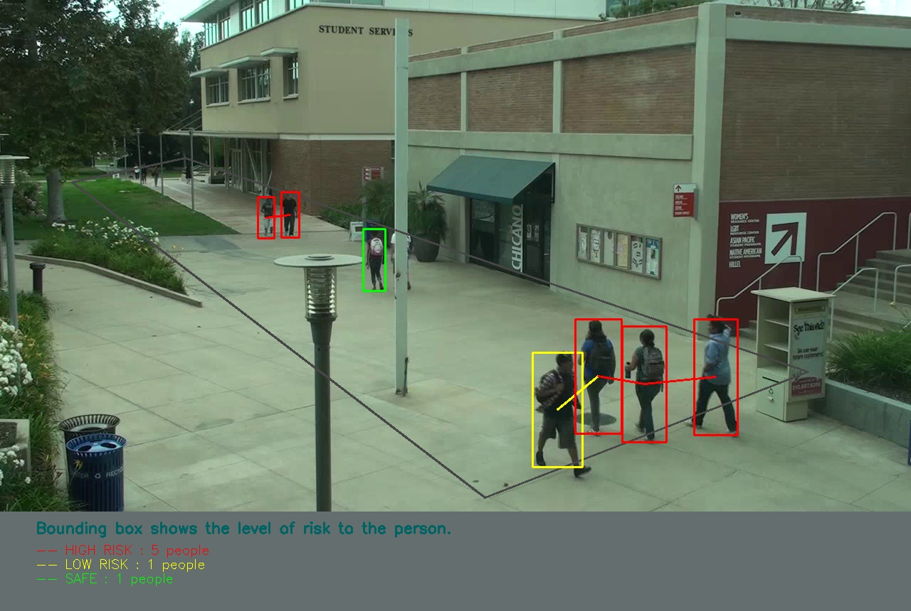

## Project's Overview

_**Theme-Name**_ : Present, Future

_**Application-Type**_ :    Application

_**Idea-Description**_ :   We are going to develop a "**Social Distancing Monitoring**" application with the help of image processing technology. This application can handle 3 different types of input. It can work on image, recorded video and also with realtime cctv camera. We will be using **COCO dataset** for image classsification and labeling. We will be using **yolo v3** Algorithm for getting the best confidence level. When ever people violate social distancing a beep sound will be given to the people to check their social distancing.
<br>
<br>
_**Working**_: Initially we will be identifying people from the given any forms of input. Then a rectangular frame is drawn arround the people. Each rectangle will be indexed from 0 to n. We will be defining a threshold for the distance. Now the threshold will be compared with each and every rectangular frame from the center of it. If the distance falls below the defined threshold they will be put on a list and the other who's distance is greater than the defined threshold will be put on a seperate list. The people who falls in violating list will be highlighted with red rectangular frame and a beep sound will be given untill they maintain proper distancing. Now the people who are all following will be highlighted with green rectangular frame. The output frame also shows number of people in danger, safe, and low risk people. The accuracy is very high in using this algorithm and the time taken for detection is very low.
<br>

_**Tech-Stack-Used**_ :   Image Processing, Yolo v3 Algorithm, COCO Dataset, Artificial Intelligence.

_**Required Installation**_

```shell
$ pip install numpy
$ pip install cv2
$ pip install math
$ pip install pyaudio
$ pip install winsound
$ pip install time
```

_**File Structure**_ :

    video.py    : Detects and calculates distance between humans
    utills.py   : Contain functions to calculate distance, scale, transformed points
    plot.py     : Contain functions to draw bird eye view and frame
    models      : Contain yolo weights and cfg.(It can be downloaded from the below given link.)
    data        : Contain video sample and images
    output      : Contain output frames
	camera.py   : Provides output with input from camera
	image.py    : Provides output with input as image
    
    

_**Important Instruction**_ :

**[Click here to download yolov weights file and keet it in models folder of your repository before running it.](https://pjreddie.com/darknet/yolo/)**

_**Execution Instructions**_ :

<ul>
  <li>For using Image as input RUN "image.py" file</li>
  <li>For using Video as input RUN "video.py" file</li>
  <li>For using Real time camera as input RUN "camera.py" file</li>
</ul>

_**How does it works?**_
<br>
The complete block diagram of the algorithm can be seen below.
<br>
<br>

  
_**Output**_
<br>
<br>



